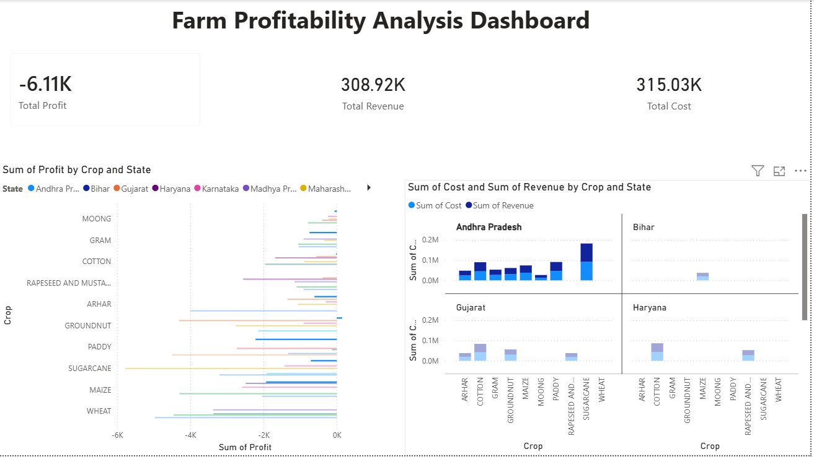

# 🌱 Farm Profitability Analysis

## 🎯 Problem Statement

The goal of this project is to analyze whether farming is profitable by comparing the cost of cultivation with the revenue generated from crop production.

---

## 📌 Project Overview

This project focuses on understanding farm profitability using agricultural data. By analyzing cost, production, and price, we determine whether farmers are making profit or loss.

---

## 🛠️ Tools & Technologies Used

* Python (Pandas, NumPy, Matplotlib)
* Power BI
* Data Analysis Techniques

---

## 📊 Dataset Description

The dataset contains the following columns:

* **Crop** – Type of crop
* **State** – Region where crop is grown
* **Cost of Cultivation (C2)** – Total cost per hectare
* **Cost of Production** – Cost per quintal
* **Yield** – Production per hectare

---

## ⚙️ Steps Performed

1. Data Cleaning (handled missing values, formatted columns)
2. Renamed columns for easier analysis
3. Feature Engineering:

   * Revenue = Yield × Price
   * Profit = Revenue − Cost
   * Profit % = (Profit / Cost) × 100
4. Data Analysis using groupby operations
5. Data Visualization using Python
6. Dashboard Creation using Power BI

---

## 📈 Key Insights

* **All crops show negative profit, indicating loss**
* **Cost of cultivation is higher than revenue**
* **Wheat has the highest loss among crops**
* **Some crops have relatively lower losses compared to others**
* **High production does not always mean high profitability**

---

## 📊 Dashboard

---

## 💡 Conclusion

The analysis shows that farming is not profitable in many cases due to high cultivation costs and relatively low selling prices. To improve profitability, it is important to reduce costs or increase the market price of crops.

---

## 🚀 Future Improvements

* Add more datasets for better accuracy
* Include price trends over time
* Build predictive model for profit estimation
* Add crop recommendation system

---

## 🙌 Author

Ashwini Bendawade
